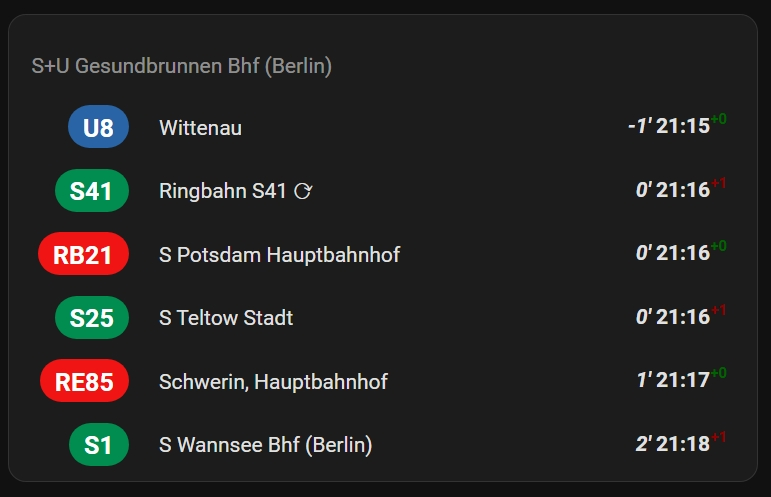
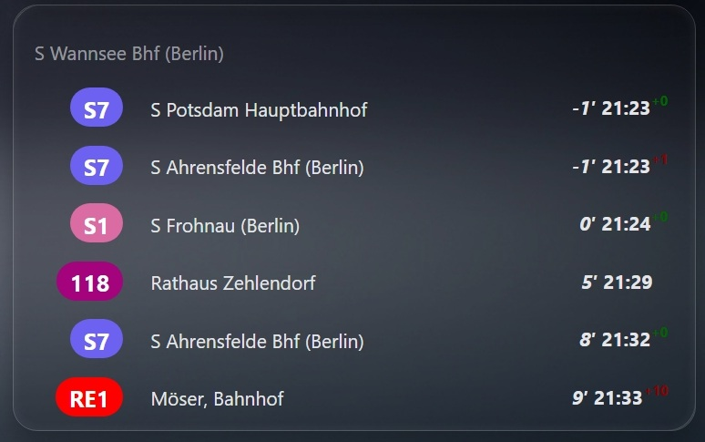
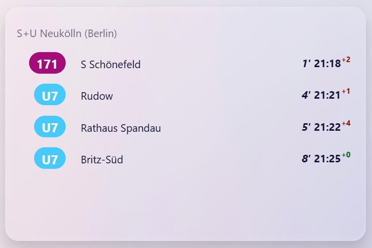

# 🚉 Berlin (BVG) & Brandenburg (VBB) Public Transport Departures for Home Assistant

> ℹ️ [Hier klicken](./docs/liesmich.md) für eine deutsche Beschreibung.

This integration brings **live public transport data** from Berlin and Brandenburg directly into your Home Assistant dashboard. It uses the official VBB API to fetch real-time departures from BVG and VBB stops — including line numbers, destinations, departure times, and delays.

Whether you're commuting, picking up your kids, or just wondering when the next Ringbahn arrives, this integration shows upcoming departures from your selected stops in a clean, readable format.

> 🛠️ This project is a fork of the original Berlin Transport integration by [vas3k](https://github.com/vas3k/home-assistant-berlin-transport) — with enhanced filtering, customization options, and independent maintenance.

## ✨ Features
- **Real-time departures** from BVG & VBB stops, including line numbers, destinations, delays, and platforms, updated every 90 seconds  
- **Dashboard card integration** for a clean, user-friendly display of upcoming departures
- **Advanced filtering options**: direction, excluded stops, transport types (bus, tram, ferry, etc.)  
- **Customization**: walking time offset, duration window, official VBB line colors, Ringbahn ⟳/⟲ toggle  
- **Localization support** with German and English translations

## 💿 Installation

This integration consists of two parts:  
1. **Integration** – fetches real-time departure data from BVG/VBB  
1. **Dashboard card** – displays the data in a clean, user-friendly format  

You need both components. The recommended way to install is via [HACS](https://hacs.xyz/) for easy updates and seamless integration. The setup takes less than 10 minutes.

If you prefer manual installation, please see the [manual installation guide](./docs/manual_install.md).

### 1. Add repositories to HACS

Open Home Assistant and go to **HACS → Three dots in top right corner → Custom repositories**. Add both of the following repositories:

- `https://github.com/manoth-msft/home-assistant-bvg-vbb-departures/` → Type: **Integration**  
- `https://github.comv/manoth-msft/home-assistant-dashboard-card-bvg-vbb-departures` → Type: **Dashboard**

Click **Add**, then reload the HACS page (hit `F5`) to make sure both repositories are available.

### 2. Search and install components via HACS

1. After refreshing the HACS page, use the search bar and type **bvg**.  
1. Add the following components:
   - **BVG/VBB real-time departures** (Integration)  
   - **Card for BVG/VBB real-time departures integration** (dashboard)
1. Open each entry and select **Download** from the lower‑right corner.
1. Wait for the download to finish. Then refresh the HACS page and restart Home Assistant to activate both components.

### 3. Add and configure integration

1. Add `BVG/VBB Departures` as a new integration under `Settings` -> `Devices & services`  
1. Search for your stop. Partial matches are supported — up to 15 relevant stops will be listed. Select the stop you want to monitor.
1. (Optional) Configure additional parameters:
    - Direction: Use `stop_id` to filter departures by direction. Provide the stop_id of stop along the intended lines or their final destination. Multiple values can be specified using a comma-separated list. See [below](#how-do-i-find-my-stop_id) for how to find the `stop id`.
    - Exclude stops: List of `stop_id` which should be excluded. Use if BVG/VBB is returning departures from nearby stops. Multiple values can be specified using a comma-separated list.
    - Duration: Defines how many minutes into the future departures should be fetched. Default is 10 minutes.
    - Walking time: Enter the time needed to walk to the stop. This prevents unreachable departures from being shown.
    - Enable official VBB line colors: Optionally enable official VBB line colors. By default, predefined colors are used.
    - Hide Ringbahn ⟳/⟲: Optionally hide Ringbahn services running clockwise or counter‑clockwise.  
        - Example: Suppose you want to monitor departures from *Treptower Park*. You set the direction filter to *900077106 (S Sonnenallee)*, because you only want to see trains heading clockwise from *Treptower Park*. However, the Ringbahn S42 ⟲ (counter‑clockwise) will also eventually reach *S Sonnenallee*, so the BVG/VBB API will return those departures as well. This option lets you hide such entries.
    - Remove *(Berlin)* suffix: The BVG appends a "(Berlin)" suffix to some stations. Enable this option to automatically remove this suffix from all stops.
    - Transport options: Choose which transport types (e.g., bus, ferry) to show or hide.
1. Done. If you want to change options later on, just run through the steps again with the same stop. The previous entity will be overwritten automatically.

### Install sensor component manually

The manual installation steps are described [here](./docs/manual_install.md).

#### How do I find a `stop_id`?

Unfortunately, I didn't have time to figure out a proper user-friendly approach of adding new components to Home Assistant, so you will have to do some routine work of finding the IDs of the nearest transport stops to you. Sorry about that :)

Simply use this URL: **https://v6.vbb.transport.rest/locations?results=1&query=alexanderplatz**

Replace `alexanderplatz` with the name of your own stop.

> 🧐 **Pro tip:**
> You can also use their [location-based API](https://v6.vbb.transport.rest/api.html#get-stopsnearby) to find all stops nearby using your GPS coordinates.

## 👩‍💻 Technical details

This sensor uses VBB Public API to fetch all transport information.

- API docs: [https://v6.vbb.transport.rest/api.html](https://v6.vbb.transport.rest/api.html)
- Rate limit: 100 req/min
- Format: [HAFAS](https://github.com/public-transport/hafas-client)

The component updates every 90 seconds, but it makes a separate request for each stop. That's usually enough, but I wouldn't recommend adding dozens of different stops so you don't hit the rate limit.

The VBB API occasionally returns 503 or timeout errors due to temporary instability. While these responses are not uncommon, they do not affect the functionality of the integration beyond generating warning messages in the Home Assistant logs. At present, there is no reliable workaround for this behavior.

After fetching the API, it creates one entity for each stop and writes 10 upcoming departures into `attributes.departures`. The entity state is not really used anywhere, it just shows the next departure in a human-readable format. If you have any ideas how to use it better — welcome to Github Issues.

> 🤔
> In principle, the HAFAS format is standardized in many other cities too, so you should have no problem adapting this component to more places if you wish. Check out [transport.rest](https://transport.rest/) for an inspiration.

## ❤️ Contributions

Contributions are welcome. Feel free to [open a PR](https://github.com/manoth-msft/home-assistant-bvg-vbb-departures/pulls) and send it to review. If you are unsure, [open an Issue](https://github.com/manoth-msft/home-assistant-bvg-vbb-departures/issues) and ask for advice.

## 🐛 Bug reports and feature requests

Since this is my small hobby project, I cannot guarantee you a 100% support or any help with configuring your dashboards. I hope for your understanding.

- **If you find a bug** - open [an Issue](https://github.com/manoth-msft/home-assistant-bvg-vbb-departures/issues) and describe the exact steps to reproduce it. Attach screenshots, copy all logs and other details to help me find the problem.
- **If you're missing a certain feature**, describe it in Issues or try to code it yourself.

## 👮‍♀️ License

- [MIT](./LICENSE.md)
